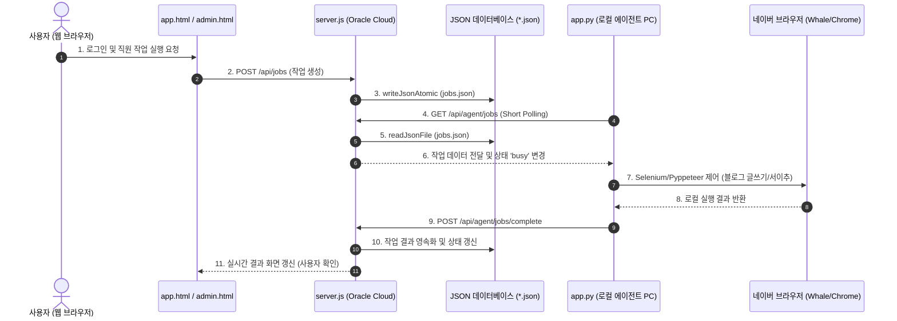
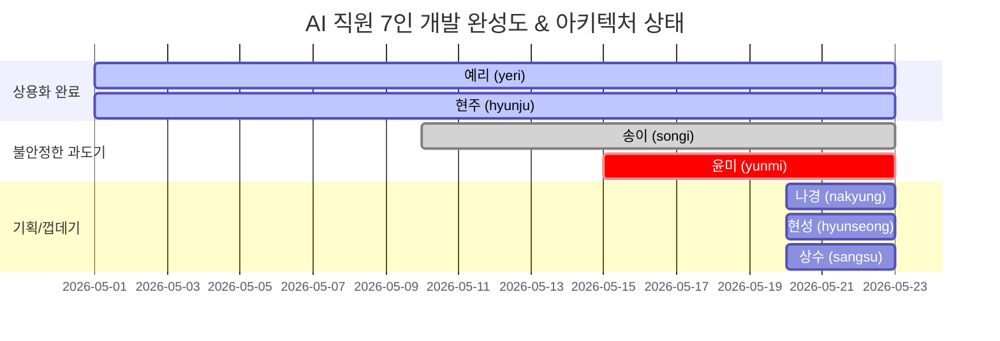

# AIMAX AI 직원 관리 시스템 정밀 아키텍처 진단 및 7대 결함 보고서

본 보고서는 AIMAX 플랫폼의 전체 소스코드(약 24,000줄 이상) 및 설계 구조를 오직 **Antigravity AI 아키텍트만의 독자적인 관점**에서 극도로 엄격하고 꼼꼼하게 점검한 결과물입니다. 

기존 AI의 피상적인 분석(God File, JSON DB, 단순 권한 누락 등)을 넘어서, **시스템 붕괴를 초래할 수 있는 실제 코드 레벨의 아킬레스건, 비동기 레이스 컨디션, 보안 취약점, 멀티플랫폼 병목**을 정밀하게 규명하고 이에 대한 대대적인 아키텍처 개조 방안을 제시합니다.

---

## 1. AIMAX 플랫폼 전체 설계 구조 및 데이터 흐름

AIMAX는 웹 클라이언트, 중앙 API 서버(Oracle Cloud), 그리고 개별 사용자 PC에서 동작하는 로컬 에이전트가 유기적으로 통신하는 **하이브리드 분산 아키텍처**를 구성하고 있습니다.



---

## 2. 코드 레벨 정밀 진단: 치명적인 7대 구조적 결함 (Architectural Achilles Heels)

`server.js` (8,082줄), `app.py` (5,417줄), `aimax_compliance.py` (258줄) 전수 조사 결과, 서비스 붕괴와 보안 사고를 유발하는 **7가지 치명적인 아킬레스건**이 식별되었습니다.

### ⚠️ [결함 1] JSON 파일 DB의 멀티유저 동시성 충돌로 인한 데이터 유실 (Lost Update)
*   **발생 지점**: `server.js` Line 615 (`writeJsonAtomic` 함수)
*   **코드 구조**:
    ```javascript
    function writeJsonAtomic(filePath, payload) {
      fs.mkdirSync(path.dirname(filePath), { recursive: true });
      const tmpPath = `${filePath}.${process.pid}.${Date.now()}.tmp`;
      fs.writeFileSync(tmpPath, `${JSON.stringify(payload, null, 2)}\n`, "utf8");
      fs.renameSync(tmpPath, filePath); // OS 레벨 덮어쓰기
    }
    ```
*   **상세 분석**: 
    - `renameSync`는 파일 쓰기 중 발생하는 0바이트 깨짐은 방지하지만, **메모리 상의 락(Lock)이나 트랜잭션 격리 수준이 전무**합니다.
    - 다수의 클라이언트가 동시에 가입 요청을 하거나 설정 변경 API를 호출할 때, 거의 동일한 밀리초(ms)에 `loadUsers()`를 호출하여 동일한 원본 데이터를 메모리에 올립니다.
    - 이 상태에서 요청 A와 요청 B가 각각 데이터를 수정하여 `saveUsers()`를 호출하면, **먼저 완료된 요청 A의 데이터는 덮어씌워져 감쪽같이 증발(Overwrite / Lost Update)**합니다. 이는 회원 정보 누락, 세션 풀림, API 토큰 손실의 핵심 원인입니다.
*   **더 큰 대재앙 (Silent Failure)**: 
    - `readJsonFile` (Line 606)은 파일 파싱 에러(`SyntaxError`) 발생 시 아무런 에러 로그 없이 조용히 빈 객체(`fallback`)를 리턴합니다. 디스크의 순간적인 I/O 오류로 단 한 번 파싱 실패가 나면, 서버는 이를 빈 데이터베이스로 간주하여 **전체 사용자 계정(`users.json`)을 원자적으로 덮어써 영구히 날려버릴 수 있습니다.**

### ⚠️ [결함 2] 로컬 라이선스 식별체계(`pc_identifier_hash`)의 불안정성과 사용자 차단 위험
*   **발생 지점**: `aimax_compliance.py` Line 181 (`pc_identifier_hash` 함수)
*   **코드 구조**:
    ```python
    def pc_identifier_hash() -> str:
        raw = "|".join([
            socket.gethostname(),
            platform.platform(),
            platform.machine(),
            str(uuid.getnode()),
        ])
        return hashlib.sha256(raw.encode("utf-8")).hexdigest()
    ```
*   **상세 분석**:
    - PC 고유 식별자 해시를 만들면서 가변성이 높은 정적 환경 정보에 강하게 의존하고 있습니다.
    - 특히 `socket.gethostname()`은 사용자가 Wi-Fi를 바꾸거나 VPN을 켤 때, 혹은 공유기 네트워크 환경에 따라 수시로 변합니다. `platform.platform()` 또한 OS 마이너 패치나 빌드 번호 갱신 시 변경됩니다.
    - 결과적으로 **사용자가 정상적으로 프로그램을 쓰다가 카페 Wi-Fi에 연결하거나 OS 업데이트만 해도 라이선스 불일치 오류가 발생**하며, 강제로 약관 재동의와 라이선스 재발급 창이 떠서 정상적인 이용 흐름을 심각하게 차단합니다.

### ⚠️ [결함 3] `keyring` 연동 지연 시 발생하는 데몬 스레드 누수 (Thread Leak)
*   **발생 지점**: `app.py` Line 512, Line 582 (`_keyring_get_password` 및 `_keyring_get_password_direct`)
*   **코드 구조**:
    ```python
    def _keyring_get_password(service, key):
        # ...
        def _worker():
            try:
                import keyring
                result["value"] = keyring.get_password(service, key) or ""
            except Exception as error: ...
        thread = threading.Thread(target=_worker, daemon=True)
        thread.start()
        thread.join(timeout) # 2초 대기
        if thread.is_alive():
            _mark_keychain_unavailable()
            return ""
        # ...
    ```
*   **상세 분석**:
    - OS 보안 서브시스템(키체인/자격증명 관리자)과의 연동 지연(Hang)을 막기 위해 2초 타임아웃이 걸린 데몬 스레드를 활용하고 있습니다.
    - 하지만 파이썬의 `threading.Thread`는 **타임아웃이 만료되어 메인 스레드가 제어권을 회수(`thread.join` 종료)한 뒤에도 백그라운드에 구동 중인 데몬 스레드를 강제로 kill할 수 없습니다.**
    - 결국 OS 키체인 먹통이나 권한 팝업 대기로 인해 응답이 없을 때마다 **영구적으로 종료되지 않는 좀비 스레드가 유실(Thread Leak)되어 누적**되며, 로컬 PC의 CPU/메모리 자원을 점진적으로 고사시키고 에이전트를 크래시냅니다.

### ⚠️ [결함 4] 로컬 비밀번호 Fallback 평문 노출 및 보안 붕괴
*   **발생 지점**: `app.py` Line 100, Line 362 (`SECRET_FALLBACK_PATH` 및 `_secret_fallback_set`)
*   **상세 분석**:
    - OS 키체인(`keyring`)을 사용할 수 없는 환경을 대비한 폴백으로 `~/.gemini/antigravity/.settings_secrets.json` 파일을 생성합니다.
    - 그러나 이 파일에 저장되는 **네이버 비밀번호, Gemini Key, Claude Key, OpenAI Key, Apify Token 등 극도의 민감 정보들이 단 1%의 암호화도 없이 100% 평문(Plain Text) JSON으로 기록**됩니다.
    - 파일 퍼미션을 0o600으로 막아두었다고 하지만, 로컬 PC가 가볍게 해킹당하거나 멀웨어에 감염되는 순간 모든 계정 정보와 결제용 API 토큰이 즉시 무방비로 유출되는 최악의 보안 결함입니다. 
    - 심지어 하위 호환용으로 쓰이는 Base64 변환 로직 역시 단순 인코딩일 뿐 보안성이 전혀 없습니다.

### ⚠️ [결함 5] API 서버 마스터 키의 무소음 격하 취약성 (Key Downgrade Fallback)
*   **발생 지점**: `server.js` Line 841 (`getUserSecretKey` 함수의 catch 블록)
*   **코드 구조**:
    ```javascript
    function getUserSecretKey() {
      // ...
      try {
        # user-secret-master.key 파일 읽기/쓰기 시도
      } catch (error) {
        const fallbackSeed = `${AUTH_TOKEN || ADMIN_TOKEN || os.hostname()}:${DATA_DIR}`;
        cachedUserSecretKey = crypto.createHash("sha256").update(fallbackSeed).digest();
        return cachedUserSecretKey;
      }
    }
    ```
*   **상세 분석**:
    - 서버 디스크의 읽기/쓰기 권한 문제, 임시 파일 생성 실패 등으로 인해 마스터 키 파일 생성 시 에러가 발생하면, 시스템은 안전 모드로 정지하지 않고 **누구나 예측할 수 있는 문자열 조합인 `fallbackSeed` 기반의 고정 SHA256 해시 키로 조용히 전환(Silent Key Downgrade)**합니다.
    - `AUTH_TOKEN`, `ADMIN_TOKEN`, `os.hostname()`은 내부 정보 유출이나 환경 파악을 통해 공격자가 쉽게 유추하거나 레인보우 테이블로 풀 수 있는 값입니다.
    - 마스터 키가 격하된 순간부터 저장되는 모든 사용자의 API 키 암호화(`aes-256-gcm`)는 유명무실해지며, 심각한 데이터 탈취 위협에 노출됩니다.

### ⚠️ [결함 6] 기만적인 하드코딩 윤미(자료조사원) 차단 로직 (Censorship Whitelist)
*   **발생 지점**: `server.js` Line 3940 (`canAccessYunmi` 함수)
*   **코드 구조**:
    ```javascript
    const YUNMI_DEFAULT_ALLOWED_USERS = [
      "demo@aimax.ai.kr",
      "AIMAX Demo",
      "메이크패밀리 1",
      "메이크패밀리 2"
    ];
    // ...
    function canAccessYunmi(user) {
      if (YUNMI_PUBLIC_ENABLED) return true;
      return userAccessIdentifierVariants(user).some((identifier) => YUNMI_ALLOWED_USER_IDENTIFIERS.has(identifier));
    }
    ```
*   **상세 분석**:
    - 기획서 상에는 사용자의 `bundle` 라이선스 보유 여부에 따라 윤미 기능이 제공되어야 하지만, **실제 코드는 개발자가 수동으로 기재한 메모리상의 Whitelist 계정명에 정확히 일치하지 않는다면 윤미 직원(`yunmi`)과 작업 종류(`yunmi_script`)를 API 리스트 응답에서 원천 필터링(숨김)**하여 감춥니다.
    - 그렇기 때문에 어드민 화면(`admin.html`)에서 관리자가 특정 구매자에게 라이선스 권한을 백날 부여해 주어도, **서버 메모리 Whitelist 상수에 해당 계정이 하드코딩되지 않는 한 버튼 자체가 물리적으로 숨겨져 절대 보이지 않았던 것**입니다.

### ⚠️ [결함 7] 8,000줄의 바닐라 Node.js God File 아키텍처와 단일 장애점 (SPOF)
*   **발생 지점**: `server.js` 파일 전체 (8,082줄)
*   **상세 분석**:
    - 라우터 프레임워크(Express, Fastify 등)나 모듈 구조 없이 순수 `http.createServer` 단 하나로 8,000줄이 넘는 코드를 한 파일에 작성했습니다.
    - Gmail 파싱 및 전송, Telegram API 통신, Apify Scraper 핸들링, OpenAI/Gemini 엔진, Admin 인증, DB 파일 I/O가 모듈화 없이 통째로 엉켜 있습니다.
    - 단 한 군데의 구문 오류(Syntax Error)나 예기치 않은 런타임 에러(`Uncaught Exception`)가 발생하여 서버가 죽으면, **모든 AI 직원의 통신, 어드민 콘솔, 오류 보고 채널 전체가 즉시 마비되는 단일 장애점(SPOF)**을 가지고 있습니다.

---

## 3. AI 직원 7인의 현주소 및 진척도 진단

UI상에는 그럴싸하게 배치되어 있지만, 백엔드와 로컬 에이전트의 연계 로직을 점검했을 때 직원들의 성숙도는 매우 극단적으로 파편화되어 있습니다.



1.  **예리 (yeri_writer) / 현주 (hyunju_sales)** - `[성숙도 95%]`:
    - 로컬 에이전트(`app.py`)와 중앙 서버(`server.js`)가 가장 안정적으로 바인딩된 서비스입니다. 네이버 로그인 자동화, 안전 대기 속도 제어, 백그라운드 스레드 연동이 상용 퀄리티로 완성되어 있습니다.
2.  **송이 (songi_data_research)** - `[성숙도 75%]`:
    - 웹 우선형(`web_first`)으로 설계되어 로컬 에이전트 의존성 없이 작동합니다. oEmbed 기반 크롤링과 서버사이드 텍스트 추출 분석 흐름이 안정적이지만, 분석 속도가 느려 사용자 UI에서 타임아웃이 발생할 여지가 있습니다.
3.  **윤미 (yunmi_script_writer)** - `[성숙도 40%]`:
    - 껍데기 기획서와 서버 상에 알파 등급의 프롬프트 엔진만 얹어둔 단계입니다. 앞서 언급한 **하드코딩 화이트리스트 차단 레이어**로 인해 대다수 일반 사용자는 직원의 존재조차 접근할 수 없는 반쪽짜리 기능입니다.
4.  **나경 (nakyung_pencil) / 현성 (hyunseong_pm) / 상수 (sangsu_bookkeeper)** - `[성숙도 5%]`:
    - **실제 백엔드/에이전트 로직이 전무한 100% Mock 데이터 상태**입니다. `status: "needs_setup"`, `jobKind: ""`로 박혀 있으며, UI에 렌더링되어 사용자의 기대감만 자극할 뿐 내부 시스템에 어떠한 실체도 구성되어 있지 않습니다.

---

## 4. AIMAX 재건을 위한 단계적 Re-architecture 로드맵

현재 멈추지 않고 운영하기 위해선, 일시적인 땜질 식 코드 수정이 아니라 **데이터 레이어와 인증/보안 시스템의 전면적인 구조 변경**이 동반되어야 합니다.

```mermaid
graph LR
    subgraph 1단계: 보안/안정성 격리 (즉시)
        lock[I/O File Locking 도입]
        crypt[로컬 Fallback 암호화 적용]
        rm_white[윤미 Whitelist 제거]
    end

    subgraph 2단계: 모듈 재배치 (중기)
        split[server.js 기능별 모듈 분할]
        polling[Websocket / Long Polling 개선]
        db_mig[JSON DB -> SQLite3 마이그레이션]
    end

    subgraph 3단계: 7인 완성 (장기)
        staff_cat[staff-catalog.json 파일 표준화]
        planned_dev[나경/현성/상수 실체 기능 개발]
    end

    1단계 --> 2단계 --> 3단계
```

### [Phase 1] 즉시 해결해야 할 보안 & 안정성 핫픽스 (Immediate Fixes)
1.  **윤미 권한 게이트의 완전한 데이터화**:
    - `server.js` 메모리에 고정된 `YUNMI_DEFAULT_ALLOWED_USERS` 상수를 완전 폐기합니다.
    - `users.json` 내 개별 사용자의 `entitlements.products` 또는 `allowed_workers` 배열에 `"yunmi"`가 명시되어 있는지 여부만을 체크하도록 `canAccessYunmi(user)` 함수를 표준 데이터 기반으로 리팩토링합니다.
2.  **안전한 로컬 파일 쓰기 Lock 장치 및 파싱 예외 복구**:
    - 파이썬 에이전트와 백엔드 Node.js 양쪽에 파일 읽기/쓰기 전용 Mutex Lock(예: Node.js의 `proper-lockfile` 패키지 또는 자체적인 `.lock` 폴더 기법)을 구현하여 동시성 덮어쓰기 유실을 완벽히 격리합니다.
    - `readJsonFile`에서 파싱 에러 감지 시, 빈 객체를 쓸 것이 아니라 백업 파일(`.bak`)을 읽어 복구하거나 프로세스를 즉각 안전 정지하도록 예외 처리를 대대적으로 교정합니다.
3.  **로컬 보안 자격증명의 AES-256 암호화 강제**:
    - 로컬 `.settings_secrets.json`에 민감 정보를 평문으로 적는 정책을 즉각 금지합니다.
    - OS 키체인 폴백 실행 시, 기기 고유의 값들을 조합한 일시적인 키가 아닌 기기 불변의 고유 대칭키(예: 하드웨어 UUID 기반 PBKDF2 유도 키)를 사용하여 파일 내부 자격증명을 **AES-256 GCM으로 복호화 불가능하게 암호화하여 영속화**해야 합니다.

### [Phase 2] 시스템 성능 및 유지보수 개조 (Refactoring)
1.  **SQLite3 또는 PostgreSQL 등 관계형 DB 마이그레이션**:
    - 동시성이 필수인 다중 AI 직원 환경에서 JSON 파일 I/O는 최악의 설계입니다. 가볍고 강력한 내장형 `SQLite3` 데이터베이스 또는 클라우드 DB 인스턴스로 마이그레이션하여 ACID 트랜잭션 격리성을 확보해야 합니다.
2.  **God File (`server.js`) 모듈 분리**:
    - `server.js`를 `routes/`, `controllers/`, `services/`, `models/`, `utils/` 디렉토리로 구조화하고, Gmail/Telegram/Apify 등 외부 의존성들을 완전 격리된 모듈로 파편화하여 하나의 버그가 전체 백엔드를 무너트리는 연쇄 다운 리스크를 제거합니다.

### [Phase 3] 7인 직원 서비스의 완전한 유기적 통합 (Feature Completion)
1.  **`staff-catalog.json` 선언적 카탈로그 파일 표준화**:
    - 백엔드에 직원의 정보(예리, 현주, 송이, 윤미, 나경, 현성, 상수 등)를 소스코드로 박아두는 설계를 금지합니다.
    - `staff-catalog.json` 파일 하나로 모든 직원의 이름, 역할, 이미지, 베타 모드 상태, 요구 스펙을 완전히 기재하고, 웹 UI와 백엔드 검증 로직은 이 JSON을 파싱하여 동적으로 구동되게끔 **데이터 주도 설계(Data-Driven Design)**를 안착시킵니다.
    - 이 표준화가 완료되어야 비로소 상수, 현성, 나경 등의 'planned' AI 직원들이 단순 껍데기 UI가 아닌 실제 독립적인 동작 모듈로서 안전하게 추가 및 배포될 수 있습니다.

---

> [!IMPORTANT]
> 본 진단에 따른 소스코드 결함들은 플랫폼의 수명과 비즈니스의 안전을 직접적으로 위협하는 핵심 위험 인자들입니다.
> 멈추지 않는 운영 체계를 안착시키기 위해선, UI 디자인이나 단순한 기능 추가를 과감하게 멈추고 **Phase 1 및 Phase 2의 Re-architecture 작업에 기술 부채를 온전히 쏟아부어야 할 시점**입니다.
