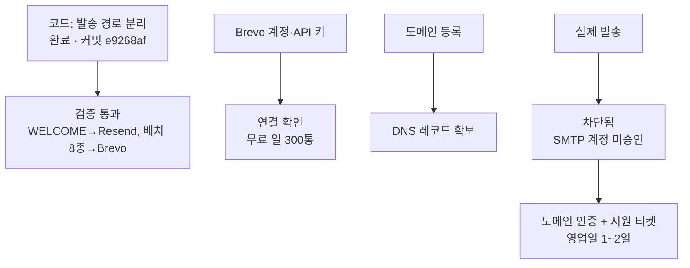

# Brevo 전환 — 벽에 부딪혔습니다. 결정 요청

<div class="decision" markdown="1">

**결정 필요** · 질문: Brevo 승인(영업일 1~2일)을 기다릴 것인가, 지금 Resend Pro를 결제할 것인가?

**추천: HOLD (일단 기다리되, 조건부)** — 확신 보통. 이번 주에 라이브 일정이 없다면 기다리는 게 맞고, 있다면 결제가 맞다.

**핵심 근거 3**
1. Brevo 무료는 **트랜잭션 발송을 수동 승인**한다. 도메인 인증을 먼저 끝내고 지원 티켓을 넣어야 하며 **영업일 1~2일** 걸린다. 오늘은 못 쓴다
2. 그 사이 위험한 날은 **라이브 일정이 있는 날뿐**이다. 그날만 126통이 됐고 평상시는 40~90통으로 한도 안이다
3. 코드는 완성됐고 `BREVO_API_KEY`가 없으면 **기존 Resend 동작 그대로**다. 지금 배포해도 아무것도 안 바뀐다(무회귀)

**가장 큰 반대 근거** — 제가 "무료로 오늘 해결된다"고 했는데 틀렸다. Brevo 수동 승인 절차를 사전에 확인하지 못했다. 기다렸다가 승인이 거절되면 그 시간만 날린다.

승인하면(기다림): DNS 3개 추가 + 티켓 제출, 승인 뒤 제가 env 켜고 검증 · 거절하면(결제): Pro 결제 후 Brevo는 폐기하고 구조 개선으로 직행

</div>

## 지금까지 된 것과 막힌 것



Brevo가 반환한 오류 그대로: `Your SMTP account is not yet activated. Please contact us to request activation`

Brevo 무료 계정은 **마케팅 발송은 바로 되지만 트랜잭션(API/SMTP) 발송은 수동 심사**를 거칩니다. 심사 전제 조건이 도메인 인증이라 순서가 정해져 있습니다.

## 대표님이 해주실 것 — 두 가지

### 1. DNS 레코드 3개 추가 (hosting.co.kr 관리)

| 종류 | 호스트 | 값 |
|---|---|---|
| CNAME | `brevo1._domainkey` | `b1.aixlife-co-kr.dkim.brevo.com` |
| CNAME | `brevo2._domainkey` | `b2.aixlife-co-kr.dkim.brevo.com` |
| TXT | `@` | `brevo-code:e2b7a18f36495c9f88eebb89f72b0a76` |

**SPF는 건드리지 않습니다.** Brevo가 준 레코드 목록에 SPF가 없고, DKIM만으로 DMARC 정렬이 됩니다. 기존 `include:_spf.google.com`을 잘못 수정하면 **회사 Google 메일 전체가 깨질 수 있어** 손대지 않는 것이 맞습니다.

기존 DMARC(`v=DMARC1; p=none;`)도 그대로 두시면 됩니다. Brevo가 제안한 값은 리포트 수신처만 추가하는 선택 사항입니다.

### 2. Brevo 확인 메일 클릭 + 지원 티켓 제출

`naminsoo@aixlife.co.kr`로 발신자 확인 메일이 갔습니다. 클릭해 주세요.

그 다음 Brevo 대시보드에서 티켓을 넣어주시면 됩니다. 아래를 그대로 붙여넣으시면 됩니다.

<details markdown="1">
<summary>티켓 본문 (복사용)</summary>

```
Subject: Request to activate transactional email sending

Hello,

I would like to request activation of transactional email sending for my account.

- Website: https://lounge.aimax.ai.kr
- Type: transactional email only (not marketing campaigns)
- Emails we send: event-day reminders and course progress notifications
  to members who registered on our learning community and agreed to receive them
- Sending domain: aixlife.co.kr (domain authentication in progress)
- Expected volume: about 1,500 emails per month, peak around 100 per day

We are currently sending these through another provider and are splitting
batch notifications to Brevo to stay within daily limits.

Thank you.
```

</details>

## 기다리는 동안 제가 하는 것

코드를 `BREVO_API_KEY` 없이 배포합니다. 이 상태에서는 **모든 메일이 지금처럼 Resend로 나가서 동작이 하나도 안 바뀝니다.** 승인이 떨어지면 env 하나만 켜면 즉시 전환됩니다.

같이 넣을 안전장치:
- 09:00 KST 일정알림 크론을 오후로 이동 → 쿼터 리셋 직후 선점 해제
- 넛지 크론에도 일일 캡 적용 (지금은 일정알림에만 있음)

이 둘은 Brevo와 무관하게 지금 효과가 있습니다.

## 제가 틀렸던 부분

앞선 보고서에서 "Brevo 가입 1회면 나머지는 제가 진행"이라고 했는데, **Brevo의 트랜잭션 수동 승인 절차를 미리 확인하지 않았습니다.** 무료 서비스 비교표에서 "심사: 자동"이라고 적은 것도 마케팅 발송 기준이었고 트랜잭션은 다릅니다. 이 부분은 제 조사가 부족했습니다.

무료 판단 자체가 틀린 건 아닙니다 — 승인만 나면 계산은 그대로 성립합니다. 다만 **"오늘"이 아니라 "다음 주"** 입니다.

## 결정에 필요한 질문 하나

**이번 주(오늘~다음 주 화요일)에 라이브 일정이 잡혀 있나요?**

- 없다 → 기다리는 게 맞습니다. 평상시 발송량은 한도 안입니다
- 있다 → 그날 126통이 나서 유료 고객 계정안내가 밀릴 수 있습니다. 그러면 Pro 결제가 맞습니다
