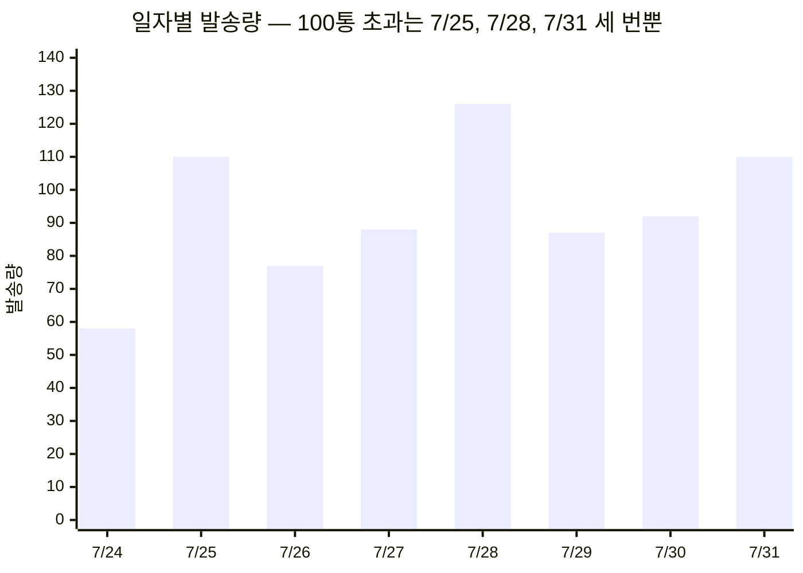
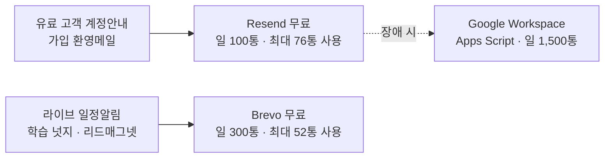

# Resend 무료로 계속 갈 수 있는가 — 결정 요청

**결정 필요** · 질문: $20 결제 대신 무료로 계속 갈 것인가?

**추천: YES (무료 유지 가능)** — 확신 높음. 단 결제를 아끼는 것보다 **지금 해야 할 정리를 하게 되는 것**이 더 큰 이득이다.

**핵심 근거 3**
1. 한도를 넘긴 날은 3일뿐이고, 전부 **배치 발송(일정알림 50통 / 넛지 52통)이 원인**이다. 이 두 개만 다른 무료 서비스로 옮기면 최대치가 126통 → **73통**으로 떨어진다
2. 남는 트랜잭션(가입환영·유료 계정안내)은 하루 최대 73통 — 무료 한도 100통 안에서 **27% 여유**
3. 옮길 곳은 Brevo 무료 **하루 300통** — 옮길 물량 52통 기준 6배 여유

**가장 큰 반대 근거** — 성장이 계속되면 트랜잭션만으로 1.4배(하루 100통)에 닿는다. 그때는 결국 유료다. 이 방안은 **6~12개월을 버는 것**이지 영구 해결이 아니다. 또 공급자가 2개가 되면 장애 지점도 2개가 된다.

승인하면: 오늘 배치 분리 + 발송 다이어트 적용 (0원) · 거절하면: Resend Pro $20/월 결제 후 구조 개선만 진행

## 지금 한도를 넘긴 날은 왜 넘었나

초과한 3일의 공통점은 **배치 발송이 낀 날**이라는 것이다.

| 날짜 | 총합 | 배치(분리 대상) | 트랜잭션(남길 것) | 배치 빼면 |
|---|---:|---|---:|---:|
| 7/25 | 110 | 일정알림 50 + 넛지 11 | 46 | **49** |
| 7/28 | **126** | 일정알림 50 | 73 | **76** |
| 7/31 | 110 | 넛지 52 | 54 | **58** |
| 7/24 | 58 | 넛지 17 | 40 | 41 |
| 7/26 | 77 | 넛지 31 | 45 | 46 |
| 7/27 | 88 | 넛지 25 | 58 | 63 |
| 7/29 | 87 | 넛지 34 | 45 | 53 |
| 7/30 | 92 | 일정알림 50 | 40 | 42 |

배치를 빼면 **최대 76통**. 무료 한도 100통 안에 전부 들어온다.

## 그래서 이렇게 나눈다

매출 직결 메일은 기존 Resend에 그대로 두고, **지연돼도 되는 배치만** 옮긴다. 매출 메일의 발신 이력과 도달률을 건드리지 않는 것이 핵심이다.

## 함께 해야 할 발송 다이어트

배치 분리만으로 지금은 해결되지만, 아래는 성장 여유를 벌면서 **법적 요건과 도달률까지 같이 해결**한다.

| 조치 | 월 절감 | 왜 어차피 해야 하나 |
|---|---:|---|
| 넛지 50% 감축 (미반응자 빈도 축소) | 약 330통 | 반응 없는 사람에게 계속 보내면 도달률이 깎인다 |
| 이메일 수신거부 도입 | — | **현재 미구현.** 정보통신망법 광고성 메일 요건 + Gmail 대량발신자 요건 |
| 반송·차단 주소 즉시 suppress | 최대 97통 | 반송률 3.6%의 주원인이 가입 오타 주소 |
| 리드매그넷을 즉시 다운로드로 변경 | 약 152통 | 메일 기다릴 필요 없어 사용자 경험도 개선 |

## AI 친구들 의견과 제 판단

두 모델 모두 "무료로 가능하다"에 동의했지만 **Google Workspace 사용 가부에서 정면으로 갈렸다.**

| 쟁점 | Gemini | GPT-5.6 Sol | 제가 직접 확인한 결과 |
|---|---|---|---|
| Workspace로 발송 | **절대 금지.** 사람 간 대화 전용, 반송률 3.6%면 회사 계정 즉시 정지 | 동의 기반 트랜잭션·운영메일은 **사용 가능**. 단 주 업무 계정은 피할 것 | **GPT가 맞다** |
| 알림톡 전환 | 추천, 건당 8~10원 | "비용 절감책이 아니라 도달 채널 다변화", 건당 13원 | **GPT가 맞다 — 무료가 아니다** |

**Gemini 주장을 기각한 이유**
- Google이 Apps Script에 Workspace 계정당 **하루 1,500 수신자** 쿼터를 공식 문서로 부여하고 있다. 이 쿼터는 프로그램 발송을 전제로 존재한다. "앱 자동 발송 금지"는 사실과 다르다
- "0.3%"는 **스팸 신고율** 기준이지 반송률 기준이 아니다. 두 지표를 혼동했다. 게다가 Google의 대량 발신자 규정은 Gmail 수신자 하루 5,000통 이상에 적용되는데 우리는 100통대다
- Resend 로그 보관을 1일이라고 했는데 공식 문서는 30일이다

**다만 Gemini가 맞는 부분** — 민수님 업무 계정(`naminsoo@`)을 자동발송에 쓰면 정지 시 **회사 메일 전체가 멈춘다**. 그래서 Workspace는 주 경로가 아니라 **장애 폴백**으로만 둔다.

상세 근거 — 무료 서비스 비교표와 조사 방법

Resend API에서 2,018건을 직접 조회해 일자별·유형별로 집계했다. 무료 한도는 각 서비스 공식 요금 페이지를 2026-08-01 기준으로 확인했다.

| 서비스 | 무료 한도 | 일일 제한 | 카드 | 심사 | 판정 |
|---|---|---|---|---|---|
| Resend | 3,000통/월 | 100통 | 불필요 | 자동 | 트랜잭션 전용으로 유지 |
| **Brevo** | 약 9,000통/월 | **300통** | 불필요 | 자동 | **배치 이관 대상** |
| SendPulse | 12,000통/월 | 400통, 시간당 50통 | 불필요 | 프로필 검토 | 대안 |
| Mailjet | 6,000통/월 | 200통 | 불필요 | 위험 검토 | 대안 |
| SMTP2GO | 1,000통/월 | 200통 | 불필요 | DNS | 월 한도 부족 |
| MailerSend | 500통/월 | 100통 | **필요** | 승인 | 부족 |
| Postmark | 100통/월 | — | 불필요 | 수동 심사 | 부족 |
| SendGrid | **영구 무료 폐지**(2025-05) | 60일만 | — | — | 제외 |
| Amazon SES | 신규 무료 종료(2026-07-21) | 샌드박스 제한 | **필요** | 엄격 | 무료 아님 |
| 네이버 Cloud Outbound | 1,000통/월 | 없음 | 필요 | 사업자 실명 | 초저가(월 약 800원) |
| 카카오 알림톡 | 없음 | — | 필요 | 템플릿 심사 | 건당 13원, 무료 아님 |

Google Workspace 경로 (이미 구독 중, 추가 비용 0원):

| 경로 | 일일 한도 | 우리 필요량 | 여유 |
|---|---:|---:|---:|
| Apps Script MailApp | 외부 수신자 1,500명 | 최대 126통 | 12배 |
| Gmail API | 메시지 2,000통 | 최대 126통 | 16배 |
| SMTP relay | 10,000통 | 최대 126통 | 79배 |

`aixlife.co.kr`은 MX·SPF 모두 Google로 확인됐다(Workspace 사용 중). AIMAX 서버 코드에는 Apps Script 웹훅 경로가 이미 완성돼 있고 스크립트 전문도 `docs/aimax_gmail_apps_script_mailer.md`에 있다. 환경변수 `AIMAX_MAIL_WEBHOOK_URL`만 설정하면 동작한다.

주요 출처: [Resend 요금](https://resend.com/pricing), [Brevo 요금](https://help.brevo.com/hc/en-us/articles/208589409-About-Brevo-s-pricing-plans), [Apps Script 할당량](https://developers.google.com/apps-script/guides/services/quotas), [Workspace Gmail 발송 한도](https://support.google.com/a/answer/166852), [Google 이용정책](https://workspace.google.com/terms/use_policy/), [SendGrid 무료 종료 공지](https://www.twilio.com/en-us/changelog/sendgrid-free-plan), [SOLAPI 알림톡 단가](https://solapi.com/pricing)

## 정직하게 말하면

무료로 가는 게 공짜는 아니다. 공급자가 2개가 되면 장애 지점도 2개가 되고, 중복 발송을 막는 처리가 필요하다. 제 구현 시간은 몇 라운드면 되지만, 운영 중 문제가 생기면 민수님 확인이 필요한 순간이 생긴다.

그럼에도 무료를 추천하는 이유는 **비용 때문이 아니다.** 배치 분리와 발송 다이어트는 유료로 전환해도 어차피 해야 하는 일이다. $20을 내면 그 일을 안 하고 넘어가게 되고, 문제는 3개월 뒤 더 큰 규모로 돌아온다.

## 결정해 주실 것

**무료로 갈까요, 결제할까요?**

- **무료** → 오늘 배치 분리 + 다이어트 적용. 민수님이 하실 일: Brevo 가입 1회(무료, 카드 불필요)
- **결제** → Pro 결제 후 도메인 3분리·수신거부 구현으로 바로 넘어감. 민수님이 하실 일: 결제 1회
