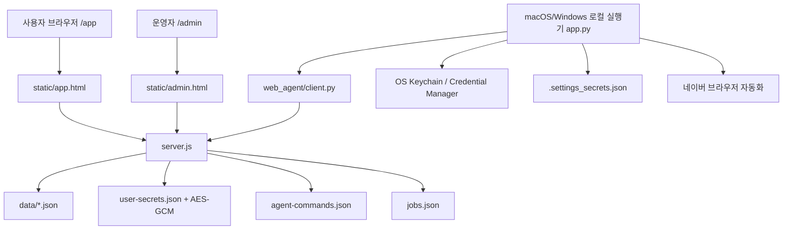

# AIMAX 현재 코드 독립 감사 보고서

- 작성일: 2026-05-23
- 작성자: Codex
- 범위: 현재 작업 폴더 `/Users/aixlife/Projects/AIMAX-AI-Staff-Management`의 실제 코드
- 제외: 기존 AI 분석 보고서, 외부 의견, 원문 비밀값, 유료 API 실행, 실제 네이버 발행/임시저장 테스트

## 1. 결론

현재 AIMAX는 기능이 "아예 없는" 상태라기보다, 기능 경계가 너무 많이 얽힌 상태입니다. 웹, 서버, 로컬 실행기, 관리자, 설치/업데이트, 직원 카탈로그, API 키 저장 위치가 각각 다른 기준으로 진화하면서 사용자는 한 화면에서 설정했다고 믿지만 실제 작업은 다른 저장소나 다른 실행기 버전을 요구하는 구조가 되었습니다.

가장 큰 문제는 세 가지입니다.

1. **예리 블로그팀은 아직 로컬 실행기 API 키를 요구합니다.** 웹 설정에 API 키를 저장해도 현재 로컬 실행기 작업은 그 키를 자동으로 사용하지 않습니다. 따라서 "웹에 키를 넣었는데 실행기는 AI Key가 없다고 실패"하는 상황이 구조적으로 발생할 수 있습니다.
2. **직원 정의가 서버, 웹, 관리자, 로컬 실행기에 흩어져 있습니다.** 송이, 윤미, 예정 직원, 블로그팀 권한/작업 종류가 서로 다른 파일에서 따로 정의되어 있어 표시, 권한, 실행 가능 상태가 어긋납니다.
3. **실행기 설치/업데이트와 설정 저장 경계가 사용자에게 불투명합니다.** 사용자는 업데이트를 했다고 생각하지만 실제 실행 중인 로컬 앱은 다른 버전일 수 있고, 키체인/로컬 파일/웹 저장 키의 관계도 화면에서 명확히 분리되지 않습니다.

따라서 추천 방향은 "전면 폐기 후 한 번에 재작성"이 아니라 **운영 중단을 막는 핫픽스 라인과 구조 재정비 라인을 분리한 단계적 리빌드**입니다. 다만 직원/작업/비밀값/작업 상태의 중심축은 새로 잡아야 하므로, 실질적으로는 핵심 도메인 구조 리빌드에 가깝습니다.

## 2. 확인한 코드 범위

주요 파일 규모:

- `oracle/aimax-reports-api/server.js`: 8,081 lines
- `oracle/aimax-reports-api/static/app.html`: 8,804 lines
- `app.py`: 5,416 lines
- `split_version/app.py`: 5,482 lines
- `oracle/aimax-reports-api/static/admin.html`: 2,161 lines
- `local_agent/runtime.py`: 914 lines
- `web_agent/client.py`: 392 lines

현재 폴더는 `git status` 기준 Git checkout이 아닙니다.

```
fatal: not a git repository (or any of the parent directories): .git
```

이 말은 현재 폴더만으로는 "어떤 변경이 배포 대상인지", "Windows 작업분과 Mac 작업분이 같은 커밋인지", "Songi/윤미/설정 핫픽스가 push에 포함되는지"를 Git 기준으로 증명하기 어렵다는 뜻입니다.

## 3. 현재 아키텍처 요약



현재 역할 분리는 다음처럼 보입니다.

- 서버: 로그인, 권한, 직원 카탈로그, 작업 큐, 오류 보고, 사용자별 웹 API 키 저장, 송이 리서치 일부 처리
- 웹앱: 직원 선택, 설정 화면, 작업 생성, 오류 보고, 업데이트 안내
- 로컬 실행기: 네이버 로그인/블로그 작성/서로이웃/브라우저 자동화, 로컬 키 저장, 서버 heartbeat/job polling
- 관리자: 사용자 권한/오류 보고/일부 직원 권한 부여

문제는 이 경계가 코드상 명확하지 않다는 점입니다. 특히 "직원은 어디서 정의되는가", "API 키는 어디가 진실인가", "작업 가능 여부는 누가 판단하는가"가 여러 곳에 나뉘어 있습니다.

## 4. 핵심 발견 사항

### P0. 예리는 웹 저장 API 키만으로 아직 동작하지 않는다

근거:

- 서버는 사용자별 API 키 저장 API를 제공합니다.
  - `oracle/aimax-reports-api/server.js:6299` `handlePutUserSecret`
  - `oracle/aimax-reports-api/server.js:817` `getUserSecretKey`
- 웹 화면도 `Gemini`, `OpenAI`, `Claude`, `Apify` 저장 상태를 표시합니다.
  - `oracle/aimax-reports-api/static/app.html:3190` `USER_SECRET_FIELDS`
  - `oracle/aimax-reports-api/static/app.html:5761` `renderUserSecrets`
- 그러나 예리 실행은 로컬 실행기의 `_worker_remote_job()`에서 먼저 로컬 자격 확인을 합니다.
  - `app.py:1785` `_worker_remote_job`
  - `app.py:1791` `self._validate_credentials(need_api=(kind == "yeri_write"))`
- 실제 글 생성 키도 로컬 UI 변수에서 읽습니다.
  - `app.py:4168` `_worker_write`
  - `app.py:4193-4204` `self.api_key_var`, `self.claude_key_var`, `self.openai_key_var`

영향:

- 사용자가 웹 설정에 API 키를 저장해도, 현재 예리 로컬 실행기는 그 키를 읽지 않습니다.
- "설정했는데 AI API Key 설정이 필요합니다"류 실패가 다시 나올 수 있습니다.
- 사용자 입장에서는 "웹 설정"과 "로컬 보안 설정"의 차이를 알 수 없어 반복 입력과 불신이 생깁니다.

권고:

- 단기: 웹에서 예리 실행 전 "현재 버전은 로컬 실행기에도 글 생성 AI 키가 필요합니다"라고 정확히 막거나, 로컬 실행기로 웹 키 import 명령을 성공/실패까지 보여줘야 합니다.
- 중기: 예리의 글 생성은 서버에서 웹 저장 키로 처리하고, 로컬 실행기는 네이버 에디터 입력/저장 자동화만 담당하게 분리해야 합니다.
- 장기: 블로그팀 외 직원은 기본 `web-first`로 설계하고, 로컬 실행기는 OS/브라우저 자동화가 필요한 경우에만 요구해야 합니다.

### P0. 직원 카탈로그와 작업 종류가 단일 기준이 아니다

근거:

- 서버 `WORKERS`는 예리/현주/윤미/송이/예정 직원을 정의합니다.
  - `oracle/aimax-reports-api/server.js:165` `WORKERS`
- 서버 `JOB_KINDS`에는 `yeri_write`, `hyunju_find`, `yunmi_script`만 있습니다.
  - `oracle/aimax-reports-api/server.js:298` `JOB_KINDS`
- 서버의 송이 상품 카탈로그는 `job_kinds: []`입니다.
  - `oracle/aimax-reports-api/server.js:1139`
- 웹은 별도로 `songi_research` job kind를 하드코딩합니다.
  - `oracle/aimax-reports-api/static/app.html:3302` `jobKinds`
- 웹은 다시 `/api/workers` 카탈로그를 받아 기존 하드코딩 객체와 병합합니다.
  - `oracle/aimax-reports-api/static/app.html:4554` `applyWorkerCatalog`
- 관리자는 송이 전체 부여 버튼은 있으나 윤미를 일반 관리자 토글로 다루는 구조는 보이지 않습니다.
  - `oracle/aimax-reports-api/static/admin.html:2084` `grantSongiAllBtn`
  - `oracle/aimax-reports-api/server.js:3940` `canAccessYunmi`

영향:

- 어떤 직원은 카드에는 보이지만 작업 API에는 없고, 어떤 직원은 권한은 있으나 관리자에서 켜고 끄기 어렵습니다.
- 예정 직원이 실제 사용 가능한 직원처럼 섞이면 사용자는 "버튼이 있는데 왜 안 되지"라고 느낍니다.
- 송이는 웹 모듈인데도 상품/작업/권한 설명이 서버와 웹에서 다르게 보일 수 있습니다.

권고:

- 직원 정의는 서버의 단일 registry로 통합해야 합니다.
- 웹은 직원/작업/필요 설정/실행 방식/상태를 모두 서버 catalog API에서 받아 렌더링해야 합니다.
- 예정 직원은 기본 숨김 또는 "준비 중" 전용 영역으로 분리해야 합니다.
- `job_kind`, `employee_code`, `execution_mode`, `required_secrets`, `required_local_capabilities`를 표준 필드로 고정해야 합니다.

### P0. 사용자가 보는 설정 저장 위치와 실제 실행 저장 위치가 다르다

근거:

- 서버 웹 API 키 저장은 `user-secrets.json`에 AES-GCM 암호화 형태로 저장합니다.
  - `oracle/aimax-reports-api/server.js:817` `getUserSecretKey`
  - `oracle/aimax-reports-api/server.js:852` `encryptUserSecret`
- 로컬 실행기는 OS keyring을 우선 사용합니다.
  - `app.py:512` `_keyring_get_password`
- keyring이 막히면 로컬 fallback 파일을 사용합니다.
  - `app.py:100` `SECRET_FALLBACK_PATH`
  - `app.py:373` `_save_secret_fallback_data`
  - `app.py:394` `_secret_fallback_set`
- 로컬 보안 설정 저장은 현재 패치 기준으로 네이버 계정 중심 저장 함수가 분리되어 있습니다.
  - `app.py:675` `save_local_security_settings`
- 그러나 일반 저장 함수는 여전히 provider key 인자를 모두 받습니다.
  - `app.py:662` `save_settings`

영향:

- 사용자는 웹 설정, 로컬 보안 설정, keychain, fallback 파일의 차이를 이해할 수 없습니다.
- 업데이트 후 UI가 바뀌면 "키가 사라졌다"고 느낄 수 있습니다. 실제로는 웹 저장 키와 로컬 저장 키가 다른 공간에 있을 수 있습니다.
- keyring을 쓰지 않는 환경에서는 fallback 파일이 생기며, 이 경우 보안과 안내가 모두 중요합니다.

권고:

- 최종 기준은 다음처럼 분리해야 합니다.
  - Naver ID/password/session: 로컬 실행기 전용
  - Gemini/OpenAI/Claude/Apify: 웹 사용자별 암호화 저장 전용
  - 예리 로컬 자동화: 서버에서 생성된 안전한 작업 결과만 받아 네이버에 입력
- 단기적으로는 로컬 설정 화면에서 provider key 입력란을 숨기거나 읽기 전용 안내로 바꾸고, 웹 설정으로 이동시키는 것이 맞습니다.
- 단, 기존 사용자가 로컬에 넣어둔 provider key는 동의 기반 import로 한 번만 웹에 옮기고, 완료/실패를 명확히 보여줘야 합니다.

### P1. 서버 JSON 저장소가 운영 규모와 장애 복구에 약하다

근거:

- 서버는 주요 데이터를 JSON 파일로 저장합니다.
  - `oracle/aimax-reports-api/server.js:80-88` `SESSIONS_PATH`, `USER_SECRETS_PATH`, `JOBS_PATH`, `AGENTS_PATH`, `COMMANDS_PATH`
- JSON 읽기 실패 시 fallback을 조용히 반환합니다.
  - `oracle/aimax-reports-api/server.js:606` `readJsonFile`
- 쓰기는 atomic rename이지만 read-modify-write 전체에 대한 lock/transaction은 없습니다.
  - `oracle/aimax-reports-api/server.js:615` `writeJsonAtomic`

영향:

- 파일 손상, partial read, 동시 업데이트 충돌이 나도 사용자는 "데이터가 사라진 것처럼" 볼 수 있습니다.
- 운영자 입장에서는 오류 원인이 DB 손상인지 앱 로직인지 구분하기 어렵습니다.
- 작업/명령/세션/비밀값 상태가 모두 JSON에 흩어져 있어 장애 조사와 롤백이 어렵습니다.

권고:

- 즉시 가능한 최소 개선: JSON schema validation, backup rotation, corrupt quarantine, write lock, read error logging.
- 구조 개선: SQLite WAL 또는 Postgres로 이전해야 합니다. 최소한 jobs/commands/reports/user_secrets는 트랜잭션 저장소가 필요합니다.

### P1. 서버 암호화 키 fallback이 조용히 약해질 수 있다

근거:

- 명시 암호화 키가 없으면 파일에 master key를 생성합니다.
  - `oracle/aimax-reports-api/server.js:817` `getUserSecretKey`
- 파일 생성/읽기 실패 시 `AUTH_TOKEN`, `ADMIN_TOKEN`, hostname, DATA_DIR 기반 hash로 fallback합니다.
  - `oracle/aimax-reports-api/server.js:841-844`

영향:

- 운영 환경에서 권한 문제로 master key 파일을 못 쓰면, 별도 경고 없이 예측 가능성이 더 높은 fallback key를 사용할 수 있습니다.
- 서버 재배포/환경 변경 시 기존 웹 저장 키 복호화 실패가 발생할 수 있습니다.

권고:

- 운영에서는 `AIMAX_USER_SECRET_ENCRYPTION_KEY`를 필수 환경변수로 강제해야 합니다.
- fallback 사용 시 서버 시작을 실패시키거나 최소한 admin health에 치명 경고를 표시해야 합니다.
- key rotation 절차와 backup 정책이 필요합니다.

### P1. 로컬 fallback 비밀값은 평문 JSON이다

근거:

- fallback 파일 경로는 사용자 데이터 디렉토리의 `.settings_secrets.json`입니다.
  - `app.py:100`
- `_secret_fallback_set()`은 값을 그대로 JSON에 저장합니다.
  - `app.py:394-399`
- chmod 0600은 적용하지만 암호화는 없습니다.
  - `app.py:373-386`

영향:

- OS keychain을 쓰지 못하는 사용자에게는 동작상 유용하지만, 보안 기대치는 낮아집니다.
- "서버로 보내지 않는다"와 "내 PC에 안전하게 저장한다"는 표현이 fallback 환경에서는 과장될 수 있습니다.

권고:

- fallback 사용 여부를 UI에 명확히 표시해야 합니다.
- 가능하면 OS별 DPAPI/Keychain 대체 암호화 계층을 사용해야 합니다.
- fallback 파일에는 Naver password만 허용하고 provider API key는 웹 저장으로 이동시키는 것이 안전합니다.

### P1. 로컬 설정 열기/명령 처리 상태 기계가 아직 약하다

근거:

- 웹은 `/api/agent/commands`로 `open_settings` 명령을 생성합니다.
  - `oracle/aimax-reports-api/static/app.html:7922` `openLocalSettings`
- 서버는 queued command를 실행기에 전달하면 바로 `delivered`로 바꿉니다.
  - `oracle/aimax-reports-api/server.js:7235` `handleAgentNextCommand`
- 완료/실패는 실행기가 별도 update를 보내야 합니다.
  - `oracle/aimax-reports-api/server.js:7276` `handleAgentCommandUpdate`
- command delivered 이후 timeout/reclaim/retry 정책이 명확하지 않습니다.

영향:

- 사용자는 버튼을 눌렀는데 "창이 떴는지, 뒤에 숨었는지, 실행기가 멈췄는지" 알기 어렵습니다.
- 완료 응답이 누락되면 웹은 느리게 느껴지고, 기존에는 오류 보고에도 잘 안 잡혔습니다.
- 최근 패치로 자동 오류 보고가 붙었지만, 상태 기계 자체의 근본 보강은 아직 필요합니다.

권고:

- command 상태를 `queued -> delivered -> started -> succeeded/failed/expired`로 명확히 나눠야 합니다.
- delivered 후 일정 시간 완료가 없으면 서버가 `expired` 처리하고 웹에 정확히 표시해야 합니다.
- 실행기 쪽은 설정창 생성 성공, 포커스 성공, 저장 완료를 별도 이벤트로 보내야 합니다.

### P1. 설치/버전 관리가 제품 안정성의 병목이다

근거:

- 서버에는 전역/latest/min 버전과 플랫폼별 버전 env가 있습니다.
  - `oracle/aimax-reports-api/server.js:132-150`
- 웹은 필수 업데이트 여부를 기준으로 실행 차단 문구를 표시합니다.
  - `oracle/aimax-reports-api/static/app.html:4833` `jobBlockReason`
- 로컬 실행기는 heartbeat에서 자신의 버전과 readiness를 서버로 보냅니다.
  - `app.py:1393` `_collect_web_agent_readiness`
  - `app.py:1447` `_web_agent_loop`

영향:

- 서버 env, 다운로드 파일, 설치된 로컬 앱, 실행 중인 프로세스가 어긋나면 사용자는 최신 설치를 했다고 믿어도 웹에는 구버전으로 보입니다.
- Mac/Windows가 동시에 움직일 때 한쪽만 반영되거나, build 산출물과 서버 catalog가 다를 수 있습니다.

권고:

- 릴리스 manifest를 단일 파일/API로 만들고, 서버 env와 다운로드 파일명을 수동으로 맞추는 방식을 줄여야 합니다.
- 실행기는 시작 시 자신의 build id, git sha 또는 release id를 보고해야 합니다.
- Mac/Windows 모두 "설치됨", "실행 중", "웹이 보는 버전"을 같은 화면에 표시해야 합니다.

### P1. `app.py`와 `split_version/app.py` 중복이 회귀를 만든다

근거:

- `app.py`: 5,416 lines
- `split_version/app.py`: 5,482 lines
- 두 파일 모두 로컬 실행기 핵심 흐름을 포함합니다.

영향:

- 한 파일에 핫픽스를 넣어도 다른 파일에 누락될 수 있습니다.
- Windows/macOS 빌드가 어떤 파일을 기준으로 하는지 매번 확인해야 합니다.
- "윈도우는 됐는데 맥은 안 됨", "맥은 됐는데 윈도우는 옛 화면" 같은 문제가 반복됩니다.

권고:

- 실행기 공통 로직은 패키지 모듈로 분리하고, platform entrypoint만 얇게 둬야 합니다.
- `split_version`은 빌드 산출용이라면 자동 생성물로 취급하고 수동 수정 금지해야 합니다.
- CI에서 두 entrypoint의 핵심 함수 차이를 검사해야 합니다.

### P2. 서버와 웹이 너무 큰 단일 파일이다

근거:

- `server.js`는 8,081 lines이며 라우터, 데이터 저장, 권한, 관리자, 다운로드, 오류 보고, 연구, 작업 큐를 모두 포함합니다.
- `app.html`은 8,804 lines이며 HTML/CSS/상태관리/API/렌더링/작업 제출/오류 보고를 한 파일에서 처리합니다.

영향:

- 작은 수정도 넓은 회귀를 만들기 쉽습니다.
- 특정 직원만 고치려 해도 공통 화면/권한/설정/작업 큐를 건드리게 됩니다.
- 신규 직원 추가 시 설계 검토 없이 하드코딩이 늘어납니다.

권고:

- 당장 프레임워크 전환보다 먼저 모듈 경계를 나눠야 합니다.
- 서버는 `auth`, `users`, `workers`, `jobs`, `agents`, `secrets`, `reports`, `research`, `downloads`로 분리합니다.
- 웹은 `employee catalog`, `settings`, `jobs`, `agent connection`, `reports`, `songi`, `admin`을 분리합니다.

## 5. 지금 작동 가능한 기반

완전히 버려야 하는 코드는 아닙니다. 이미 살릴 수 있는 기반이 있습니다.

- 사용자별 웹 API 키 저장 API가 존재합니다.
- AES-GCM으로 사용자 secret을 암호화하는 구조가 들어와 있습니다.
- 로컬 실행기 heartbeat/readiness/job polling 구조가 있습니다.
- 오류 보고 payload는 환경, 실행기 상태, 최근 jobs를 담을 수 있습니다.
- 송이는 `web_module`로 등록되어 있어 "실행기 불필요 직원" 방향과 맞습니다.
- 현주는 예리보다 단순한 로컬 자동화라 안정화 대상으로 분리하기 쉽습니다.

이 기반을 살리되, 경계를 다시 잡아야 합니다.

## 6. 지금 바로 막아야 할 회귀

### 6.1 API 키 삭제/소실 체감

현재 패치로 `save_local_security_settings()`가 provider key를 건드리지 않도록 분리되어 있지만, 사용자가 이미 삭제된 것으로 느끼는 경우가 있습니다.

필요 조치:

- 웹 저장 키와 로컬 저장 키를 화면에서 구분 표시
- 기존 로컬 key import 성공/실패 결과 표시
- import 후 "웹 저장됨" 상태 즉시 갱신
- provider key가 비어 보이는 것은 보안상 원문을 다시 보여줄 수 없다는 점을 한국어로 설명

### 6.2 예리 실행 전 잘못된 준비 완료 표시

현재 웹은 일부 조건에서 readiness가 `missing`이어도 Naver와 selected AI가 ready로 보이면 허용합니다. 그러나 selected AI ready가 로컬 기준인지 웹 기준인지 섞이면 실패할 수 있습니다.

필요 조치:

- 예리 실행 전 실제 사용할 credential source를 명시해야 합니다.
- 현재 구조에서는 "로컬 실행기 AI 키 필요" 또는 "웹 키 import 완료 필요" 중 하나를 강제해야 합니다.

### 6.3 실행기 설정창 무한 대기

필요 조치:

- `open_settings` command에 `expired` 상태 추가
- 웹 토스트만이 아니라 설정 버튼 옆에 "요청 전달됨/창 열림/응답 없음" 상태 표시
- 자동 오류 보고에 command id, agent id, platform, current version 포함

## 7. 권장 구조

### 7.1 직원 실행 방식 표준화

모든 직원은 다음 셋 중 하나로 분류해야 합니다.

- `web-first`: 서버/웹에서 작업 가능. 로컬 실행기 불필요. 송이, 윤미가 여기에 해당.
- `local-agent-required`: OS/브라우저/로컬 파일 자동화가 핵심. 예리의 네이버 에디터 입력, 현주의 네이버 자동화가 여기에 해당.
- `hybrid`: 서버가 생성/분석하고 로컬 실행기가 최종 브라우저 자동화만 수행. 예리는 최종적으로 이 방향이 맞습니다.

이 분류는 서버 catalog의 필수 필드가 되어야 합니다.

### 7.2 비밀값 저장 원칙

- 웹 AI/API 키: 서버 사용자별 암호화 저장
- Apify 토큰: 서버 사용자별 암호화 저장, 송이가 서버에서 사용
- Naver 계정/세션: 로컬 실행기 저장
- 로컬 fallback: keychain 불가 환경의 제한적 대체 수단. 사용 여부 표시
- 웹에서 로컬로 provider secret을 내려보내는 흐름은 금지
- 로컬에서 웹으로 기존 provider key를 가져오는 흐름은 사용자 동의 후 1회성 import로만 허용

### 7.3 작업 처리 원칙

- `jobs`는 서버가 상태의 기준입니다.
- 로컬 실행기는 작업을 가져간 뒤 상태 전이를 반드시 보고합니다.
- 상태는 최소한 다음을 가져야 합니다.
  - `queued`
  - `assigned`
  - `running`
  - `waiting_user`
  - `succeeded`
  - `failed`
  - `cancelled`
  - `expired`
- 유료 API는 submit 이후 재시도 전에 기존 request/job id를 조회해야 합니다.

### 7.4 오류 보고 원칙

오류 보고에는 다음이 항상 들어가야 합니다.

- 직원명
- 작업 종류
- 실패 단계
- 사용자에게 보인 한국어 메시지
- 내부 error code
- job id 또는 command id
- 실행기 플랫폼/버전/build id
- credential source 상태: `web_user`, `local_keychain`, `local_fallback`, `missing`
- 단, API key/token/password/cookie/signed URL은 절대 포함하지 않음

## 8. Mac/server 작업과 Windows 작업 구분

### Mac/server 쪽 우선 작업

1. 서버 worker registry를 단일 기준으로 정리
2. 웹 직원 목록을 서버 catalog 기반 렌더링으로 전환
3. 사용자별 웹 API 키 저장 상태와 실행 credential source 표시 개선
4. 송이 Apify 토큰을 웹 저장 키 기준으로 서버에서 사용
5. 예리 작업 전 credential source mismatch 차단
6. 오류 보고 자동 수집 범위에 command/job timeout 추가
7. JSON 저장소 backup/schema/lock 또는 SQLite/Postgres 이전 설계

### Windows/local-agent 쪽 우선 작업

1. 최신 소스 기준 재빌드 여부 확인
2. `app.py`와 `split_version/app.py`의 로컬 설정 UI 차이 확인
3. 로컬 보안 설정이 Naver 중심으로 표시되는지 확인
4. provider API 키 입력란이 불필요하게 다시 나타나지 않는지 확인
5. keychain/Credential Manager 불가 환경에서 fallback 안내와 저장 동작 확인
6. `open_settings` command 완료/실패 응답이 서버에 돌아오는지 확인
7. 예리 작업에서 로컬 AI key 필요 여부를 웹 안내와 일치시키기

### 공통 검증

- macOS 설치 후 실행 중 버전이 웹 업데이트 화면과 일치
- Windows 설치 후 실행 중 버전이 웹 업데이트 화면과 일치
- 웹 API 키 저장 후 상태가 `웹 저장됨`으로 표시
- 로컬 설정 저장 후 창이 무한 로딩 없이 종료 또는 명확한 상태 표시
- 예리 실행 전 필요한 설정 부족 시 한국어로 차단
- 현주 실행 전 서로이웃 멘트 부족 시 한국어로 차단
- 송이는 실행기 없이 프로젝트 생성/링크 입력/분석 대기/오류 보고 가능

## 9. 단계별 실행 계획

### Phase 0. 운영 중단 완화

목표: 사용자가 바로 헷갈리는 부분과 반복 실패를 줄입니다.

작업:

- 예리 실행 전 로컬/API 키 mismatch 정확히 차단
- 로컬 설정창 command timeout 자동 오류 보고 강화
- 웹/로컬 저장 키 구분 문구 정리
- Mac/Windows 최신 설치 파일과 서버 version manifest 일치 확인

검증:

- 유료 API 없이 설정 저장/상태 표시/command 흐름 smoke
- 네이버 실제 저장/발행 없이 driver 초기화 전 단계까지 dry-run

### Phase 1. 직원/권한/작업 registry 통합

목표: 직원 표시와 실행 가능 여부의 기준을 하나로 만듭니다.

작업:

- 서버 `WORKERS`/`JOB_KINDS`/admin product catalog 통합
- 웹 하드코딩 직원 목록 제거 또는 fallback 전용으로 축소
- 관리자에서 직원별 enable/disable 상태 관리
- 예정 직원은 별도 상태로 숨김 또는 준비 중 표시

검증:

- bundle, blog_team, songi 단독 권한별로 보이는 직원과 가능한 작업이 일치
- Yunmi/Songi가 관리자 상태와 웹 표시가 일치

### Phase 2. 비밀값 저장 경계 재정의

목표: API 키와 Naver 계정의 저장 위치를 명확히 분리합니다.

작업:

- 웹 provider secrets를 canonical source로 확정
- Apify/Gemini/OpenAI/Claude는 웹 저장만 새 UI에서 허용
- Naver 계정은 로컬 실행기에서만 관리
- 기존 로컬 provider key는 동의 기반 import

검증:

- 기존 로컬 key import가 성공하면 웹 상태가 즉시 갱신
- import 실패 시 사용자가 다음 행동을 알 수 있음
- fallback 사용 환경에서도 보안 안내가 명확함

### Phase 3. 예리 hybrid 재구성

목표: 예리에서 가장 비용/실패가 큰 글 생성과 네이버 자동화를 분리합니다.

작업:

- 서버가 웹 저장 AI key로 글/이미지 생성
- 결과물과 이미지 asset을 job artifact로 저장
- 로컬 실행기는 artifact를 받아 네이버 에디터 입력/저장/발행만 수행
- 실패 시 생성 artifact를 재사용해 중복 유료 호출 방지

검증:

- AI 생성 성공 후 네이버 입력 실패 시 재시도해도 AI 유료 호출을 반복하지 않음
- 로컬 브라우저 자동화 실패가 명확히 `editor_input`, `naver_login`, `publish` 등으로 분류

### Phase 4. 저장소/테스트/릴리스 정비

목표: 배포 때마다 새 회귀가 생기지 않게 합니다.

작업:

- JSON 저장소를 SQLite WAL 또는 Postgres로 이전
- release manifest와 build id 도입
- Mac/Windows CI smoke matrix 구축
- `app.py`/`split_version/app.py` 중복 제거
- 서버와 웹 파일 모듈화

검증:

- Mac/Windows 빌드 산출물이 같은 manifest를 보고함
- no-paid smoke, no-Naver-write smoke가 자동 통과
- 대표 오류 보고 케이스별 회귀 테스트 보유

## 10. 최종 판단

현재 상태는 "작은 버그 몇 개만 잡으면 안정화" 단계는 지났습니다. 특히 API 키 저장 위치, 직원 registry, 실행기 버전, 작업 상태 기계가 서로 맞지 않아 업데이트를 할수록 새 오류가 발생하기 쉬운 구조입니다.

그러나 완전 폐기식 리빌드는 운영 리스크가 큽니다. 이미 로그인, 권한, 오류 보고, 로컬 heartbeat, 사용자별 secret, 일부 직원 UI는 존재합니다. 따라서 추천은 다음입니다.

1. **당장 운영을 막는 예리/API 키/설정창/버전 mismatch를 핫픽스합니다.**
2. **직원 registry와 secret source를 단일 기준으로 정리합니다.**
3. **예리는 hybrid 구조로 재구성하고, 송이/윤미 같은 직원은 web-first로 고정합니다.**
4. **저장소와 릴리스 체계를 바꿔 Mac/Windows가 같은 기준으로 움직이게 합니다.**

이 순서로 가지 않으면, 새 직원을 추가할수록 "버튼은 있는데 안 됨", "키를 넣었는데 없다고 함", "업데이트했는데 버전이 다름", "오류 보고가 늦게 잡힘" 문제가 반복될 가능성이 높습니다.

